# Entity-Relationship Diagram (MVP)

Grouped by bounded context. This is the target schema; migrations build it up phase by phase.
Rendered with Mermaid — GitHub and most Markdown viewers display it inline.

```mermaid
erDiagram
    %% ── Identity & Access ──
    profiles ||--o{ user_roles : has
    roles ||--o{ user_roles : grants
    roles ||--o{ role_permissions : includes
    permissions ||--o{ role_permissions : granted_by
    profiles ||--o{ user_branch_assignments : assigned_to
    branches ||--o{ user_branch_assignments : covers
    profiles ||--o{ audit_logs : actor
    profiles ||--o{ email_code_challenges : verifies

    %% ── Catalog ──
    categories ||--o{ inventory_items : classifies
    units ||--o{ inventory_items : base_unit
    units ||--o{ unit_conversions : from_unit
    inventory_items ||--o{ unit_conversions : defines
    inventory_items ||--o{ products : sold_as
    products ||--o{ product_variants : varies
    products ||--o{ modifiers : offers
    modifiers ||--o{ modifier_options : has
    inventory_items ||--o{ barcodes : identified_by
    products ||--o{ branch_prices : priced_per_branch
    branches ||--o{ branch_prices : sets

    %% ── Suppliers & Purchasing ──
    suppliers ||--o{ supplier_items : supplies
    inventory_items ||--o{ supplier_items : sourced_from
    supplier_items ||--o{ supplier_prices : priced
    suppliers ||--o{ purchase_orders : receives
    purchase_orders ||--o{ purchase_order_lines : contains
    purchase_orders ||--o{ purchase_receipts : fulfilled_by
    purchase_receipts ||--o{ purchase_receipt_lines : records
    suppliers ||--o{ supplier_returns : returned_to

    %% ── Recipes & Costing ──
    inventory_items ||--o{ recipes : produces
    products ||--o| recipes : sale_recipe
    product_variants ||--o| recipes : variant_recipe
    modifier_options ||--o| recipes : deduction_recipe
    recipes ||--o{ recipe_versions : versioned
    recipe_versions ||--o{ recipe_lines : consumes
    inventory_items ||--o{ recipe_lines : input
    recipe_versions ||--o{ cost_snapshots : costed

    %% ── Production ──
    recipes ||--o| production_templates : templated_as
    production_templates ||--o{ production_orders : plans
    recipe_versions ||--o{ production_orders : frozen_for
    cost_snapshots ||--o{ production_orders : valued_by
    production_orders ||--o{ production_order_inputs : consumes
    recipe_lines ||--o{ production_order_inputs : copied_from
    inventory_items ||--o{ production_order_inputs : input
    production_orders ||--o{ stock_transactions : posts
    inventory_items ||--o{ inventory_lots : tracked_as

    %% ── Inventory core ──
    branches ||--o{ inventory_balances : holds
    inventory_items ||--o{ inventory_balances : balance
    stock_transactions ||--o{ stock_transaction_lines : has
    inventory_items ||--o{ stock_transaction_lines : moves
    inventory_lots ||--o{ stock_transaction_lines : from_lot
    branches ||--o{ stock_requests : requests
    stock_requests ||--o{ stock_request_lines : lists
    stock_requests ||--o{ transfers : fulfilled_by
    transfers ||--o{ transfer_lines : ships
    transfers ||--o{ stock_transactions : posts
    transfer_lines ||--o{ transfer_lot_allocations : allocated_from
    inventory_lots ||--o{ transfer_lot_allocations : source_or_destination
    transfers ||--o{ transfer_discrepancies : flags
    transfer_lines ||--o{ transfer_discrepancies : explains
    inventory_items ||--o{ inventory_alerts : warns_for
    branches ||--o{ inventory_alerts : warns_at
    stock_transactions ||--o{ inventory_alerts : causes

    %% ── Control ──
    branches ||--o{ recount_sessions : counted
    recount_sessions ||--o{ recount_lines : counts
    recount_lines ||--o{ recount_variances : varies
    branches ||--o{ daily_operational_closures : closed
    approval_requests ||--o{ approval_history : tracked

    %% ── Ops & UX ──
    branches ||--o{ calendar_events : scheduled
    calendar_events ||--o| popup_event_sessions : detail
    profiles ||--o{ notifications : notified
    profiles ||--o{ notification_preferences : configures

    %% ── POS V2 (schema only) ──
    products ||--o{ pos_item_mappings : mapped
    pos_transaction_mappings ||--o{ pos_sync_logs : logged
    import_jobs ||--o{ import_rows : parses
```

> Full column-level definitions live in [`../DATABASE_SCHEMA.md`](../DATABASE_SCHEMA.md).
