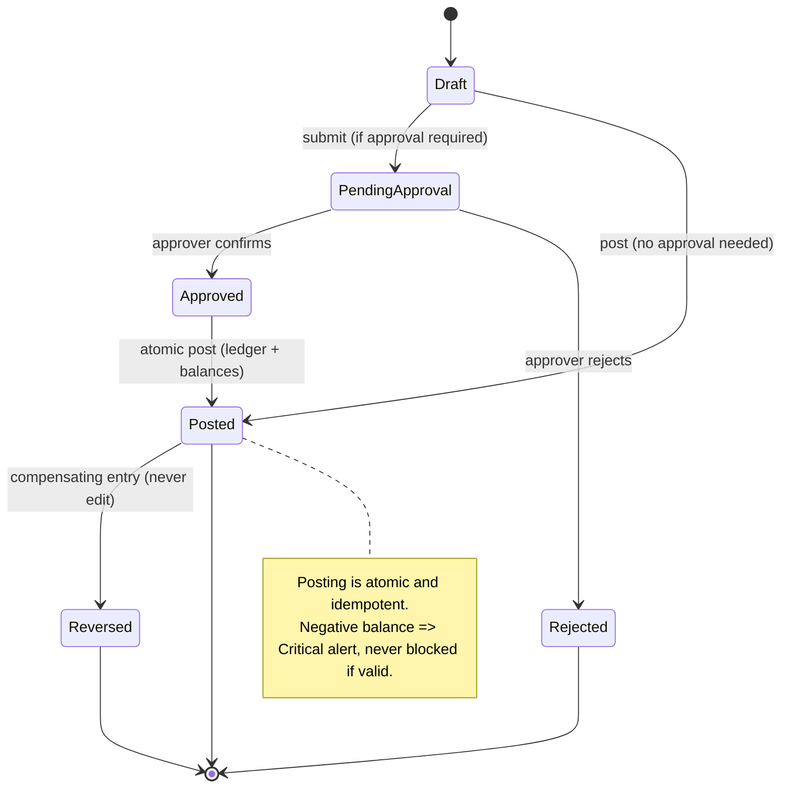
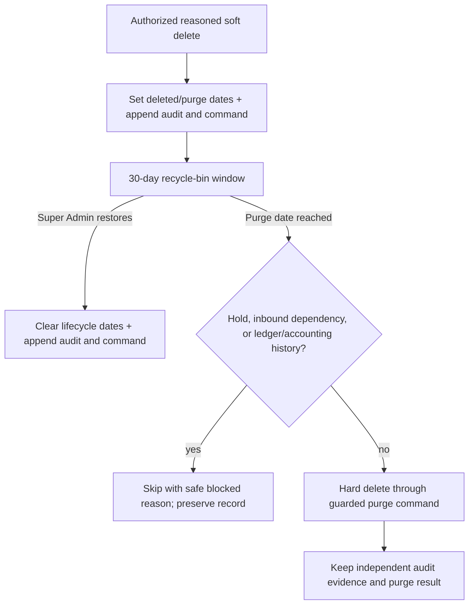
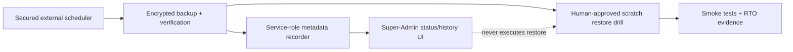
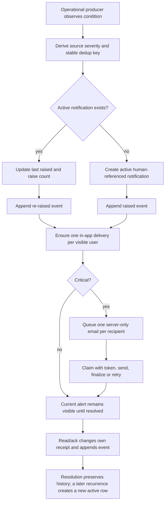
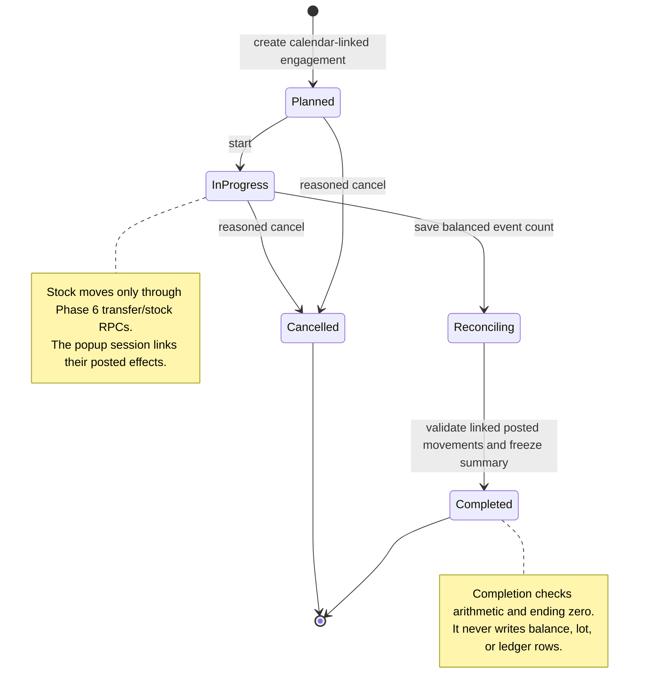
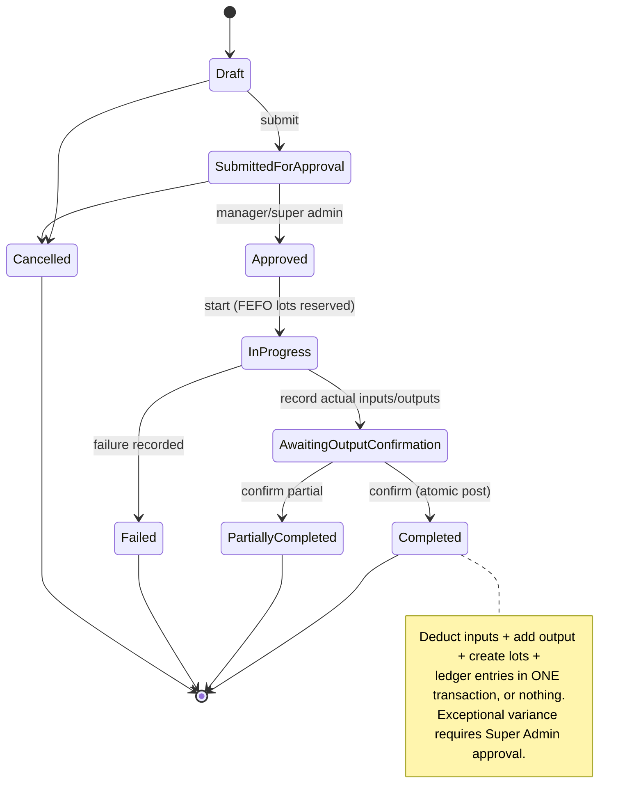
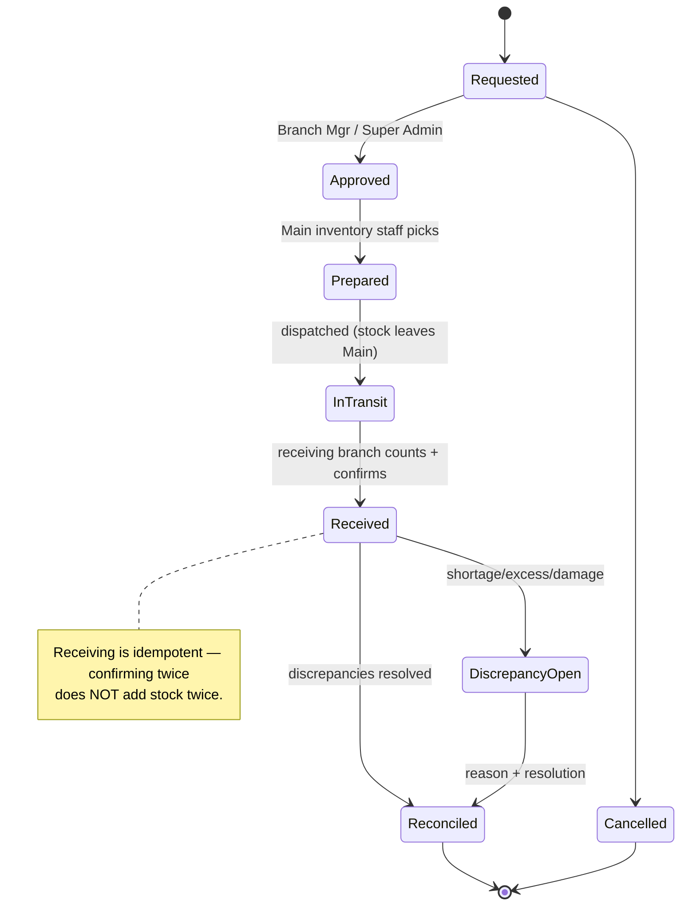
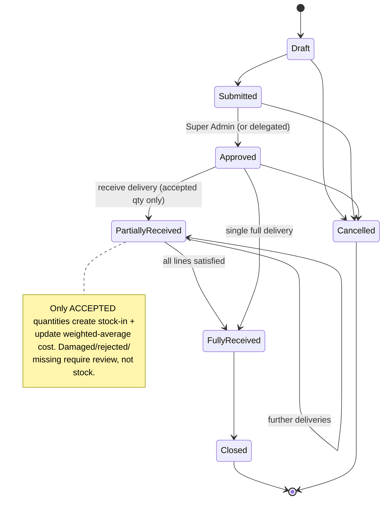
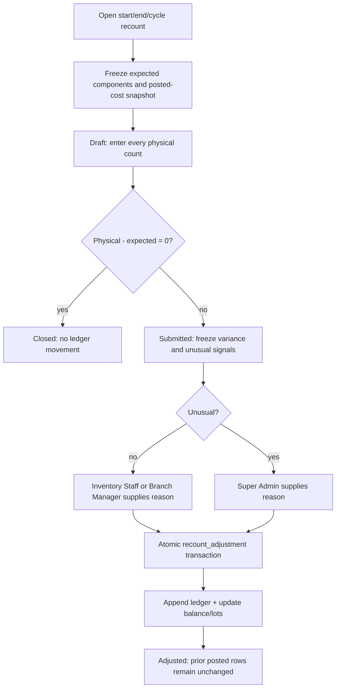
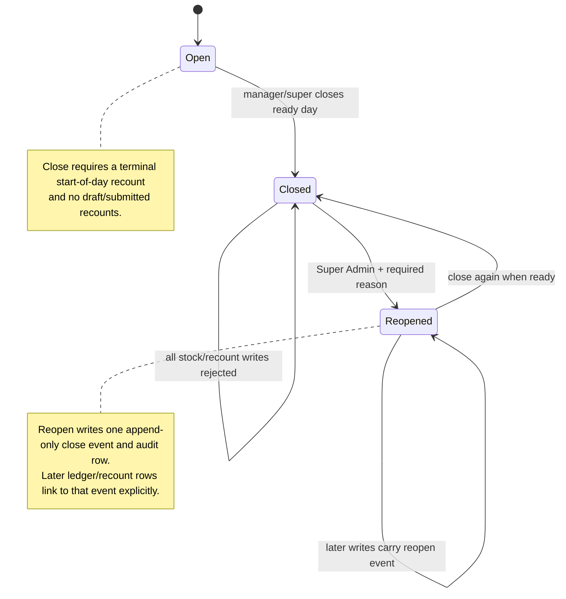

# Workflow & State Diagrams

## Stock Ledger — transaction lifecycle

## Recycle-bin lifecycle

## Backup status and recovery boundary

## Notification condition and delivery

## Popup engagement reconciliation

## Production workflow

## Transfer workflow

## Purchase receiving workflow

## Recount → compensating adjustment

Expected quantity is frozen to four decimals as
`opening + received + production output - transfers out - usage - stock-outs - waste`. The
variance value and adjustment ledger line copy the frozen existing cost snapshot; no finalized cost
is recomputed.

## Day close → audited reopen

