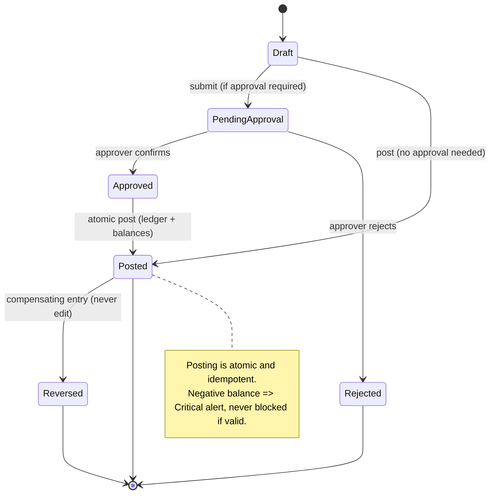
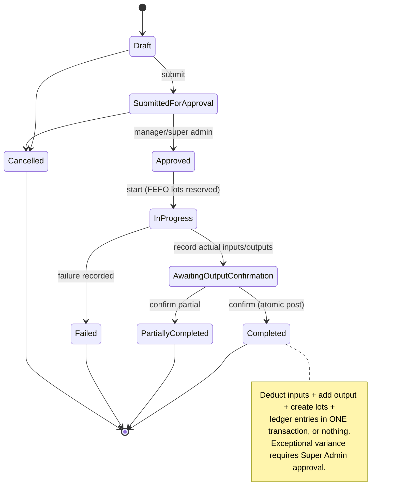
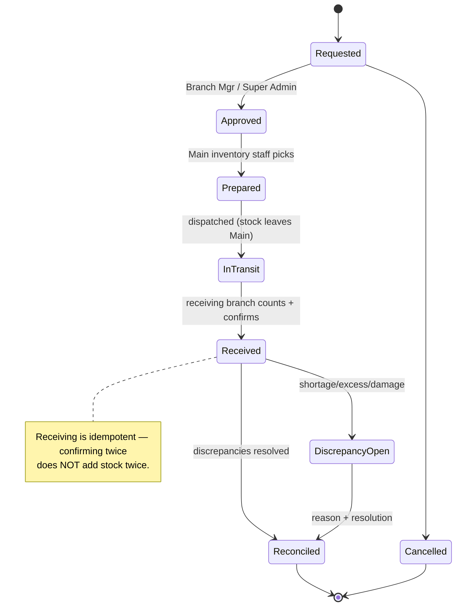
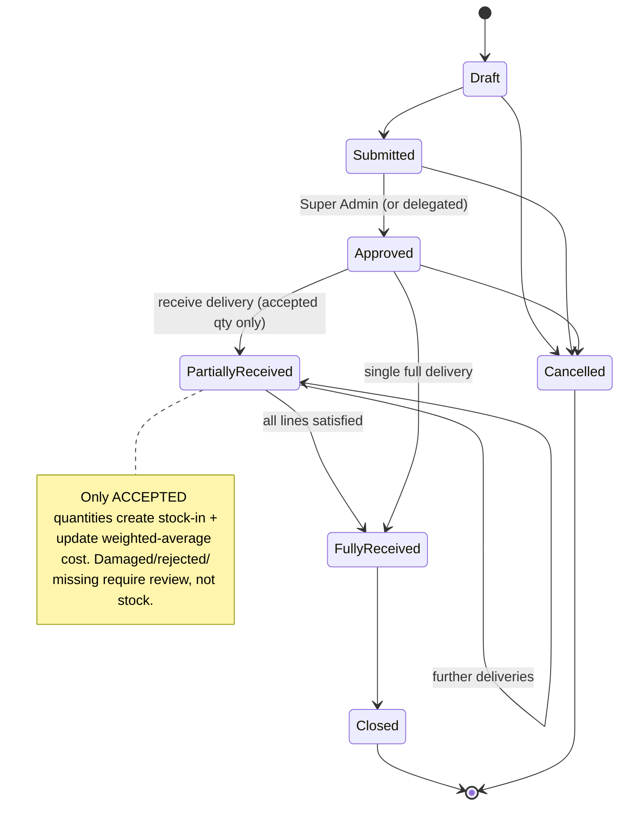
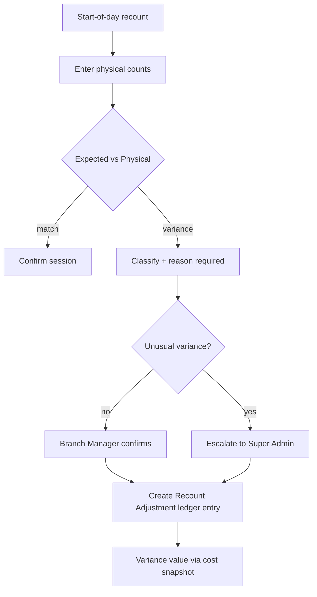

# Workflow & State Diagrams

## Stock Ledger — transaction lifecycle

```mermaid
stateDiagram-v2
    [*] --> Draft
    Draft --> PendingApproval : submit (if approval required)
    Draft --> Posted : post (no approval needed)
    PendingApproval --> Approved : approver confirms
    PendingApproval --> Rejected : approver rejects
    Approved --> Posted : atomic post (ledger + balances)
    Posted --> Reversed : compensating entry (never edit)
    Rejected --> [*]
    Reversed --> [*]
    Posted --> [*]
    note right of Posted
        Posting is atomic and idempotent.
        Negative balance => Critical alert, never blocked if valid.
    end note
```

## Production workflow

```mermaid
stateDiagram-v2
    [*] --> Draft
    Draft --> SubmittedForApproval : submit
    SubmittedForApproval --> Approved : manager/super admin
    Approved --> InProgress : start (FEFO lots reserved)
    InProgress --> AwaitingOutputConfirmation : record actual inputs/outputs
    AwaitingOutputConfirmation --> Completed : confirm (atomic post)
    AwaitingOutputConfirmation --> PartiallyCompleted : confirm partial
    InProgress --> Failed : failure recorded
    Draft --> Cancelled
    SubmittedForApproval --> Cancelled
    Completed --> [*]
    PartiallyCompleted --> [*]
    Failed --> [*]
    Cancelled --> [*]
    note right of Completed
        Deduct inputs + add output + create lots +
        ledger entries in ONE transaction, or nothing.
        Exceptional variance requires Super Admin approval.
    end note
```

## Transfer workflow

```mermaid
stateDiagram-v2
    [*] --> Requested
    Requested --> Approved : Branch Mgr / Super Admin
    Approved --> Prepared : Main inventory staff picks
    Prepared --> InTransit : dispatched (stock leaves Main)
    InTransit --> Received : receiving branch counts + confirms
    Received --> Reconciled : discrepancies resolved
    Received --> DiscrepancyOpen : shortage/excess/damage
    DiscrepancyOpen --> Reconciled : reason + resolution
    Requested --> Cancelled
    Reconciled --> [*]
    Cancelled --> [*]
    note right of Received
        Receiving is idempotent — confirming twice
        does NOT add stock twice.
    end note
```

## Purchase receiving workflow

```mermaid
stateDiagram-v2
    [*] --> Draft
    Draft --> Submitted
    Submitted --> Approved : Super Admin (or delegated)
    Approved --> PartiallyReceived : receive delivery (accepted qty only)
    PartiallyReceived --> PartiallyReceived : further deliveries
    PartiallyReceived --> FullyReceived : all lines satisfied
    Approved --> FullyReceived : single full delivery
    FullyReceived --> Closed
    Draft --> Cancelled
    Submitted --> Cancelled
    Approved --> Cancelled
    Closed --> [*]
    Cancelled --> [*]
    note right of PartiallyReceived
        Only ACCEPTED quantities create stock-in +
        update weighted-average cost. Damaged/rejected/
        missing require review, not stock.
    end note
```

## Recount → adjustment

```mermaid
flowchart TD
    A[Start-of-day recount] --> B[Enter physical counts]
    B --> C{Expected vs Physical}
    C -->|match| D[Confirm session]
    C -->|variance| E[Classify + reason required]
    E --> F{Unusual variance?}
    F -->|no| G[Branch Manager confirms]
    F -->|yes| H[Escalate to Super Admin]
    G --> I[Create Recount Adjustment ledger entry]
    H --> I
    I --> J[Variance value via cost snapshot]
```
